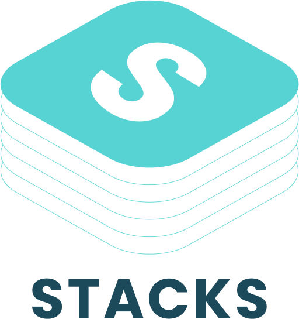

---

### **Building the AI-Powered, Truly Personal Internet**  
To make Stacks **the AI layer for a hyper-personalized internet**, here's a breakdown into **core building blocks**:  

---

## **1. Data Ownership & Personalization (User’s Digital Footprint)**
🔹 **Users own their data** → Unlike Google/Facebook, Stacks must let users control their **preferences, history, and insights** privately.  
🔹 **AI learns from user behavior, but privately** → Instead of harvesting data, Stacks should act as a **“vault” for user intelligence** that AI references but doesn’t exploit.  
🔹 **Portability** → Users should be able to take their "AI profile" anywhere online.  

🔑 **MVP Features:**  
✅ **User-owned knowledge graph** (notes, bookmarks, interactions, insights)  
✅ **AI learns from individual habits/preferences** (not mass surveillance)  
✅ **Personal API or browser extension to capture user context seamlessly**  

---

## **2. Hyper-Personalized AI Interface (Your AI, Your Internet)**
🔹 Instead of generic AI, **Stacks should mold itself to each user**.  
🔹 Think of this like **Jarvis** → an AI that **understands you deeply** and helps you navigate content, communities, and decisions.  
🔹 Should be **adaptive** → learning from user inputs and evolving **without being creepy**.  

🔑 **MVP Features:**  
✅ **Conversational AI assistant with personal context**  
✅ **AI-powered “feed” that surfaces what actually matters to the user**  
✅ **A “discovery mode” where AI helps explore new interests, communities, and content**  

---

## **3. The Interaction Layer (Making the Web Feel Personal)**
🔹 Right now, the internet is **impersonal**—you go to websites, log in separately, and get **algorithm-fed** content.  
🔹 Stacks should **bridge the gap** between users and apps/sites:  
   - Auto-fill **preferences, history, and context**  
   - Remove **ads & noise**, surface what’s actually valuable  
   - Provide **AI-powered “context switching”** across different sites  

🔑 **MVP Features:**  
✅ **AI-powered overlays for websites ((browser extension)[https://chrome.google.com/webstore/detail/nfjbjlpkfimhobegkcoekpkdlokjkcfj] + [SDK](https://engage.stacks.im))**  
✅ **Smart summaries and filters to remove internet noise**  
✅ **Unified login but privacy-first (not a tracking system, but a “passport”)**  

---

## **4. Community & Social Layer (Beyond Content, Toward Meaningful Interaction)**
🔹 Gen Z doesn’t just want **passive consumption**—they want to **engage** meaningfully.  
🔹 Stacks should **connect users to like-minded communities** without algorithmic manipulation.  

🔑 **MVP Features:**  
✅ **AI-curated social circles & community discovery**  
✅ **Real-time collaboration & conversation spaces**  
✅ **Personal AI for summarizing & engaging in online discussions**  

---

## **How Do We Build This? (Tech Stack & Roadmap)**
We can’t do all of this **at once**, so we need to **prioritize & sequence** the build.  

### **🔷 Phase 1: Foundation (3-6 Months)**
✅ **User Data Vault** (store personal AI insights, recall data, preferences)  
✅ **Personal AI Chat Interface** (simple chatbot that learns from user inputs)  
✅ **Browser Extension for Capturing & Surfacing Context**  
✅ **First Version of AI-Powered Recall & Resurfacing**  

🔧 **Tech Stack**  
- Backend: **Node.js + Supabase/Postgres (for private user data)**  
- Frontend: **React + Tailwind + T3 stack (for AI UI layer)**  
- AI: **OpenAI API (fine-tuned) + LangChain + Retrieval-Augmented Generation (RAG)**  
- Extension: **Manifest v3 Chrome/Firefox extension**  

---

### **🔷 Phase 2: Making AI Personal (6-12 Months)**
✅ **Context-Aware AI that Personalizes Responses**  
✅ **AI-Powered Web Overlay (browser assistant to filter, summarize, enhance web content)**  
✅ **Community & Social Layer (AI-enhanced engagement, personalized discovery)**  

---

### **🔷 Phase 3: The Personal Internet Layer (12-24 Months)**
✅ **Seamless AI-driven Web Personalization (a personal "OS" for the internet)**  
✅ **Interoperability with Websites & Apps (so AI can auto-adapt content for users)**  
✅ **Full Ownership & Monetization for Users (data portability, decentralized ID, incentives?)**  

---

## **Final Thoughts:**
This isn’t just **a SaaS tool**—this is **reshaping how people interact with the internet.**  

**Stacks is not “just AI-powered recall”**—it’s about making the internet **hyper-personalized, privacy-first, and AI-enhanced.**  

We believe it’s a **massive** opportunity. But the **first step is building something people actually use.** We start with the AI-powered personal data vault + browser extension.

🚀 **What do you think? 
Join us: https://betterstacks.com
